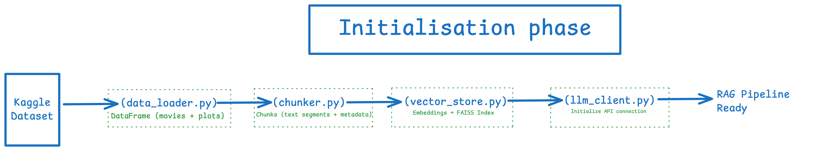
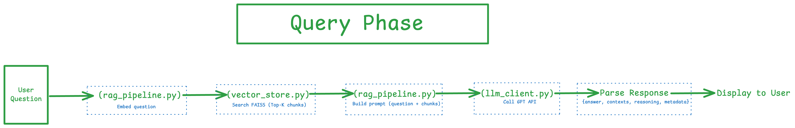

# Movie Plot RAG System

A lightweight Retrieval-Augmented Generation (RAG) system that answers questions about movie plots using semantic search and large language models.

## Overview

This system demonstrates a complete RAG pipeline that:
- Loads movie plots from the Wikipedia Movie Plots dataset
- Chunks text into ~300 word segments for better retrieval
- Creates semantic embeddings using Sentence Transformers
- Stores vectors in FAISS for fast similarity search
- Retrieves top-k most relevant chunks for queries
- Generates natural language answers using OpenAI GPT models
- Returns structured JSON output with answer, contexts, and reasoning

## Architecture

The system operates in two main phases:

### Initialization Phase

The initialization phase prepares the RAG pipeline:

1. **data_loader.py** - Loads the Kaggle dataset and creates a DataFrame with movies and plots
2. **chunker.py** - Splits text into semantic chunks (text segments) with metadata
3. **vector_store.py** - Generates embeddings and builds a FAISS index
4. **llm_client.py** - Initializes the API connection for the language model

Once complete, the RAG pipeline is ready to handle queries.

### Query Phase

The query phase handles user questions:

1. **rag_pipeline.py** - Embeds the user question
2. **vector_store.py** - Searches FAISS for top-k most relevant chunks
3. **rag_pipeline.py** - Builds a prompt combining the question with retrieved context
4. **llm_client.py** - Calls the GPT API to generate an answer
5. **Parse Response** - Extracts answer, contexts, reasoning, and metadata
6. **Display to User** - Returns the structured response